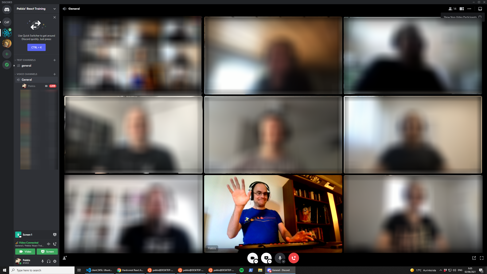

## Pekkis' Hardcore React Training

### React

[React](https://reactjs.org/) is a JavaScript library for building user interfaces, invented by Facebook. When I discovered React back in 2014, I got hooked super fast. It immediately became obvious to me that React would seriously disrupt the webdev scene, and I began to learn the library and preach it's joys to everyone who would listen.

The wisdom of hindsight prove me right. In the 2020s, React is everywhere, and I believe it's for the benefit of mankind. You shouldn’t of course fall in love with technology, tech is a tool and one should always keep a sceptical eye out for new disruptions, but all in all, React has so far proven to be sustainable.

### Pekkis

I have taught the joys of React to peers for years. For the longest time I did this within the framework of the [Finland's toughest React training](https://www.fraktio.fi/palvelut/koulutus/suomen-rankin-react-valmennus/) organized by Fraktio, and after returning from my teaching hiatus (I taught way too much in 2018 and 2019) in 2021 I'm now "silently" selling the course through my current employer, [Nitor](http://nitor.com).

You can get to know my person by googleing me (Mikko "Pekkis" Forsström is a good search term) and / or by clicking directly on the links below.

- [LinkedIn](https://www.linkedin.com/in/pekkis/)
- [Github](https://github.com/pekkis)
- [WIP Himapage Blog Portal](https://www.pekkis.eu)
- [My professional memoires, parts 1-5](https://www.pekkis.eu/blogi/2017/04/10/hopeakettu-muistelee-osa-1-laimea-uhka)
- [The Dictator Exchange](https://diktaattoriporssi.com/), my primary hobby project from the last 20+ years.
- [The Dr. Kobros Foundation](Imaginary context for hobby projects et al)

### React vs. "React"

If I were to teach the user interface library React, the course would be over in an hour. React is small and easy to learn. When people talk about React, however, they usually mean "React" in quotation marks. Indeed, a simple user interface library isn't enough to build a complete web application, so a huge ecosystem of various tools and libraries has grown around React over the years.

In two days of hands-on coaching and coding together in my workshop, we implement a small but complete React application from start to finish. The training is always up to date because I try to learn these things myself every day at work and I maintain the material in "real time" according to what I think is worth teaching and / or sharing at any given time. I will try my best to condense the most essential part of my knowledge to these two days.

All materials except me and my narrations are open source and free software licensed under the BSD license, so whatever you get from the course, you can use as you want to.

### Who is it for?

The training will be good for you if you are a software developer and / or a devsigner who will use JavaScript, React and / or other up-to-date front-end development tools in your work. Many of the topics are difficult and the pace will be rapid, so the course really _is not suitable for beginners_.

You do not need to be a guru, but I'm serious when I say that my coaching is intended for **professionals** and I expect all participants to have a professional working background in software development. In addition, you should have applicable experience in JavaScript, HTML, CSS and web development in general.

To participate in the course, you will need:

- An open mind that is freed from "real" work for the two course days.
- A computer and a development environment
  - I will send preparation instructions about a week in advance. They should take no more than fifteen minutes to complete, and completing the instructions in advance is an absolute prerequisite for participation in the course.
- During epidemics or other exceptional circumstances, coaching takes place remotely. This has consequences that vary and are difficult for me to anticipate. Please keep this in mind in your expectation values, we play with the cards that are dealt to us.
- I strongly recommend that **you have two screens** or at least one huge screen with a monster resolution. I use Discord as the remote platform and it is very good and it works with just one screen, but there's a lot of streams (my screen, VSCode LiveShare and also my face if you want to see it when I rant about something) available and you are supposed to also be coding yourself at the same time. The second screen can be something like an iPad, one main display is enough!

### Course content

We code and talk about coding for two days. I don't believe in slideshows. If there are more than 20 slides at the beginning and / or you don’t think they make any sense, you can gently punch me in the gut and make me stop.

We use libraries and ways of working that I personally think are good or otherwise worth presenting. The content lives on according to what I think is relevant and what the specicic interests of your class are. Experience has shown that in the end, only the participants determine what we do with our two days together.

We use modern JavaScript and TypeScript on top of that. This is both awful and wonderful, but since you’re 100% sure to encounter TypeScript in your day job anyways, it’s pointless to resist it. TypeScript has its own quirks and is a subjective subject, but at the basic level we are going to use it it won't slow us down too bad (and if it does, I'll just leave it broken and give you a home assignment). It's just a matter of implementing it "correctly", I think.

Here are some bulletin points for each coaching day. Don’t think of these subjects in absolute terms or order, everything is flexible. If you have specific interests or development needs, please let me know about them beforehand so that I may be able to say something deeper than usual about these subjects.

#### Day 1

- Orientation
  - Introductions
  - A small lecture
- Dev tooling: The tower of Babel
  - Package managers: NPM, Yarn, pnpm?
  - ES2021 +, TypeScript
  - Why Vite? Why not Webpack?
  - Editors, IDEs, tools, configurations, linters etc
- The basics of React
  - JSX
  - think of state and only state
  - hooks and legacy class components
  - fetching data
  - basic state management with hooks
  - presentational components with passing props
- functional paradigm and immutable data
- forms
- styling
  - component-based styling
  - styling with CSS modules and PostCSS
  - styling with CSS-in-JavaScript
  - styling in type safe TypeScript?!?!
- devtools
- debugging
- profiling
- animations (bonus subject)

#### Day 2

- state management with specialized tools
  - A brief history of state management
  - Redux, the old de facto standard (and the useReducer hook, it's little brother)
  - new alternatives
  - normalizing state
  - GraphQL, React Query, etc. (bonus subject)
- routing
- code reuse
  - more functions
  - higher order components, render props and more hooks
- testing
- building and deploying
  - code splitting
- Q & A
- Farewells

#### If we have time and / or interest

- even more advanced state management
- native web components and React
- You can do _what_ with React?
- Design systems / styleguides
- GraphQL
- ready-made boilerplates vs "do-it-yourself" deep dive
  - Create-React-App
  - JAMStack / SSR
  - Gatsby / Next
  - next gen DIY bundlers
- progressive web apps (PWA)
- internationalization & localization
- React's "competitors" and future
  - Vue
  - Svelte

### Feedback

I've teached the course many tens of times during the years. The average rating I got has been about **4.5/5**. Most of the feedback I've ever gotten belongs to my previous employer, but here are some of the recent comments (in both Finnish and English) from the couple of online courses I've held after my hiatus ended.

> "Asiat etenivät hyvällä tahdilla ja huumorilla höystettynä eteenpäin, eikä mikään tuntunut vaikealta, vaikka vaikeita konsepteja käsiteltiin. Tylsää ei kerennyt tulla missään vaiheessa. Työkalut toimivat mainiosti, ja itsellä ainakin paljon parempi seurata ja koodata omilla välineillä (== isolla näytöllä) kotona."

> "Paljon uutta laadukkaasti esitettyä sisältöä. Kouluttajalla on tarpeeksi kilometrejä takana aihealueesta. Aihealueet oli valittu hyvin ja esitetty siten, että perusteltiin myös miksi."

> "It did not feel like watching a prerecorded webinar or that the trainer did not just follow a ready-made "script". It felt like it was happening real-time and all the things we're done together with us. Of course there is a "script" and the trainer had done most of the stuff before in previous courses, but it did not _feel_ like that."

> "Paljon uutta laadukkaasti esitettyä sisältöä. Kouluttajalla on tarpeeksi kilometrejä takana aihealueesta. Aihealueet oli valittu hyvin ja esitetty siten, että perusteltiin myös miksi."

> "Thanks a million! I love the code with me while I think out loud method, because I learn well when I have to think along with you with the exact same context in my head."

> "Extremely hands on so you saw all the dirty details when things don't work out and how to resolve it. No slide show hell, but real coding. It was invaluable that real development tools and libraries were used and introduced. It was also very good to have a discussion around why things are like they are to understand that current situation and then introduce the latest libraries based on personal experience. It felt like the end result of the demo app was a realistic production level application, just the design missing :)"

> "Iso peukku hands-on-tekemiselle! Sai oikeasti tuntumaa siihen, että millaista on koodata reactia ilman sitä "silmäluomesi-alkavat-tuntua-raskailta"-fiilistä, joka tulee pelkästä teoriahöpötyksen kuuntelusta. Myös Pekkiksen innostus asiaan oli mukaansatempaavaa. LiveSharen käyttö pelasti vanhan bäkkäriklonkun pariin otteeseen kun muuten olisi pudonnut kärryiltä."

> "There was enough depth, yet it still felt casual (no pressure). I enjoyed the occasional anecdote. As far as I'm concerned, the course covered everything important to send you on your way - I think after the course, with a little exercise of course, one should be able to produce a React app in its entirety.
> While you could technically read all this information from bunch of how-to articles, there's much more added value, energy and _metadata_ when learning from a person. And this certainly isn't the case with every teacher, so kudos for that."

### Contact

Due to the ongoing coronavirus pandemic, I currently only teach the subject remotely in the context of private courses for your business. The teaching language can be English or Finnish, all the materials are in English.

The price is **6000 euros + VAT**, and for this money, a maximum of 10 people can participate. This is a practical limitation that cannot be surpassed with money, I simply can’t teach a larger set of people at once even if I wanted.

Did I spark your interest? Email me at <mikko.forsstrom@nitor.com> and we shall continue the conversation!
