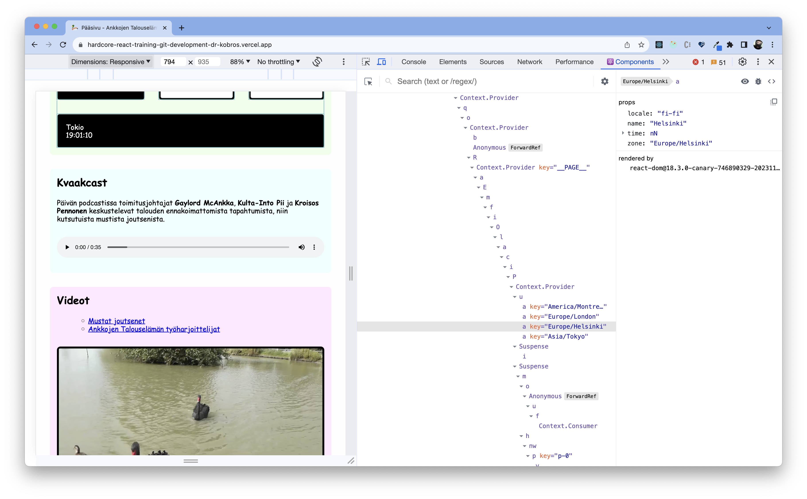

## Pekkis' Hardcore React Training

### React

[React](https://reactjs.org/) is a JavaScript library for building user interfaces, invented by Facebook in 2013. When I discovered React, I got hooked super fast. It immediately became obvious to me that React would disrupt the web development scene, and I began to learn the library and preach it's joys to everyone who would listen.

The wisdom of hindsight proved me right. In the 2020s, React is everywhere, and I continue to believe it's for the benefit of all mankind.

React was an order-of-magnitude improvement on any prior art, and to dethrone React one would need a similar jump forwards. It doesn't mean that development has stalled as React has matured, oh no - innovation has moved to a higher level. **Metaframeworks** like [Next.js](https://nextjs.org/) continue to innovate as the trend for full stack and _island architecture_ takes shape.

### Pekkis

I have taught and talked about the joys of frontend development to peers and students for as almost as long as React has existed. For the longest time I did this in the context of [Finland's toughest React training](https://www.fraktio.fi/palvelut/koulutus/suomen-rankin-react-valmennus/) organized by Fraktio. After returning from my teaching hiatus (I taught **way too much** in 2018 and 2019) I'm now semi-silently providing training services again.

You can get to know my person by googleing me (Mikko "Pekkis" Forsström is a good search term) and / or by clicking directly on the links below.

- [LinkedIn](https://www.linkedin.com/in/pekkis/)
- [Github](https://github.com/pekkis)
- [Homepage / Blog](https://www.pekkis.eu)
- [My professional memoires, parts 1-5](https://www.pekkis.eu/blogi/2017/04/10/hopeakettu-muistelee-osa-1-laimea-uhka)
- [The Dictator Exchange](https://diktaattoriporssi.com/), my primary hobby project from the last 20+ years.
- [The Dr. Kobros Foundation](https://dr-kobros.com) Imaginary context for hobby projects et al.

### React vs. "React"

If I were to teach the user interface library React, the course would be over in an hour. React is small and easy to learn. When people talk about React, however, they usually mean "React" in quotation marks. A simple user interface library isn't enough to build a complete web application, so an ecosystem of tools and libraries has grown around React over the years.

In the two days of hands-on coaching and coding in my workshop, we develop a small but complete React application from start to finish. The training is always up to date because I try to learn these things myself every day at work and I maintain the material in "real time" according to what I think is worth teaching and / or sharing at any given time. I try to condense the most essential part of my accumulated knowledge to the two training days.

All course materials except me and my narrations are **open source** and **free software** licensed under a liberal license, so whatever you get from the course, you can use as you want to.

### Who is it for?

The training will be good for you if you are a software developer and / or a devsigner who will use JavaScript / TypeScript, React and / or other up-to-date front-end development tools and methodologies in your work. Many of the topics are difficult and the pace will be rapid, so the course really _is not suitable for beginners_.

You do not need to be a guru, but I'm deadly serious when I say that the course is intended for **professionals** and I expect all participants to have a professional working background in software development. In addition, you should have applicable experience in JavaScript, HTML, CSS and web development in general.

To participate in the course, you will need:

- An open mind that is free from "real" work for the two days of the course.
- A computer and a development environment
  - I will send preparation instructions at least a week in advance. They should take no more than fifteen minutes to complete, and completing the instructions in advance is a prerequisite for participation.
- During pandemics or other exceptional circumstances, coaching takes place remotely. This has consequences that vary and are difficult to anticipate. Please keep this in mind.
- When remote, I strongly recommend that **you have two screens** or at least one huge screen with a monster resolution. I use Discord as the platform and it is very good and it works with just one screen, but there's a lot of streams (my screen, VSCode LiveShare and also my face if you want to see it when I rant about something) available and you are also supposed be coding yourself at the same time. The second screen can be something like an iPad, one main display is enough!

### Course content

**We code and talk about coding for two days**. I don't believe in slideshows. If there are too many slides at the beginning and / or you don’t think they make any sense, you can gently punch me in the gut and make me stop.

We use libraries and ways of working that I personally think are good or otherwise worth presenting. The content lives on according to what I think is relevant and what the specicic interests of your class are. Experience has shown that the participants ultimately determine what we do with our two days together.

We use TypeScript. Since you are 100% sure to encounter TypeScript in your day job anyways, it’s pointless to resist.

Here are some bulletin points for each coaching day. Don’t think of these subjects in absolute terms or order, content is flexible and changes with the times. If you have specific interests or development needs, please let me know about them beforehand so that I may be able to say something deeper than usual about these subjects.

#### Day 1

- Orientation
  - Introductions
  - A brief lecture about past, present and future
- Dev tooling
  - Package managers: NPM, Yarn, pnpm
  - Modern JavaScript, TypeScript
  - Metaframeworks / build tools.
    - We use Next.js and it's new app router as the base to access the brave new world of server components.
    - We also discuss alternatives like other metaframeworks and build tools like Vite.
  - Editors, IDEs, tools, configurations, linters etc
- The basics of React
  - JSX: a bestest abstraction.
  - think of state and only state
  - hooks
  - presentational components with just passing props
- client side rendering / server side rendering / static rendering
  - data fetching
  - server and client components
- styling
  - component-based styling in general
  - styling with CSS modules and PostCSS
  - styling with runtimeless CSS-in-JS
  - NOT styling with runtimeful CSS-in-JS
- Developer experience
  - dev tools
  - debugging
  - profiling
- theming and design systems

#### Day 2

- developing components with storybook
- functional paradigm and immutable data
- routing
- forms
- testing
  - unit testing
  - e2e-testing
  - testing testing
- code reuse
  - more functions
  - own hooks, render props, higher order components
- basics of accessibility
- performance
  - code splitting
- sustainability
- building and deploying
- animations (bonus subject)
- internationalization & localization (bonus subject)
- progressive web apps (bonus subject)
- Q & A
- Where to go next?
- Farewells

### Feedback

I've teached the course tens of times during the years. The average rating I got has been something like **4.5/5**. Most of the feedback I've gotten was left to my previous business, but here are some of the more recent comments (in both Finnish and English) from the courses I've held after my hiatus ended.

> Pekkis is not only a walking great library of web development, but also a very good lecturer! While live-coding and waist-deep in technical details, he is at all times responsive and on top of everything that goes on in the class, ready to help out.

> "Asiat etenivät hyvällä tahdilla ja huumorilla höystettynä eteenpäin, eikä mikään tuntunut vaikealta, vaikka vaikeita konsepteja käsiteltiin. Tylsää ei kerennyt tulla missään vaiheessa. Työkalut toimivat mainiosti, ja itsellä ainakin paljon parempi seurata ja koodata omilla välineillä (== isolla näytöllä) kotona."

> "Paljon uutta laadukkaasti esitettyä sisältöä. Kouluttajalla on tarpeeksi kilometrejä takana aihealueesta. Aihealueet oli valittu hyvin ja esitetty siten, että perusteltiin myös miksi."

> This humour-filled hands-on coding course and it's material was well-planned and although there was a lot to cover, we managed to sift through everything in a timely fashion during the two days. Would recommend! Ducks also appreciate well designed and coherently developed internet applications!

> "It did not feel like watching a prerecorded webinar or that the trainer did not just follow a ready-made "script". It felt like it was happening real-time and all the things we're done together with us. Of course there is a "script" and the trainer had done most of the stuff before in previous courses, but it did not _feel_ like that."

> "Paljon uutta laadukkaasti esitettyä sisältöä. Kouluttajalla on tarpeeksi kilometrejä takana aihealueesta. Aihealueet oli valittu hyvin ja esitetty siten, että perusteltiin myös miksi."

> "Thanks a million! I love the code with me while I think out loud method, because I learn well when I have to think along with you with the exact same context in my head."

> "Extremely hands on so you saw all the dirty details when things don't work out and how to resolve it. No slide show hell, but real coding. It was invaluable that real development tools and libraries were used and introduced. It was also very good to have a discussion around why things are like they are to understand that current situation and then introduce the latest libraries based on personal experience. It felt like the end result of the demo app was a realistic production level application, just the design missing :)"

> "Iso peukku hands-on-tekemiselle! Sai oikeasti tuntumaa siihen, että millaista on koodata reactia ilman sitä "silmäluomesi-alkavat-tuntua-raskailta"-fiilistä, joka tulee pelkästä teoriahöpötyksen kuuntelusta. Myös Pekkiksen innostus asiaan oli mukaansatempaavaa. LiveSharen käyttö pelasti vanhan bäkkäriklonkun pariin otteeseen kun muuten olisi pudonnut kärryiltä."

> "There was enough depth, yet it still felt casual (no pressure). I enjoyed the occasional anecdote. As far as I'm concerned, the course covered everything important to send you on your way - I think after the course, with a little exercise of course, one should be able to produce a React app in its entirety.

> While you could technically read all this information from bunch of how-to articles, there's much more added value, energy and _metadata_ when learning from a person. And this certainly isn't the case with every teacher, so kudos for that."

> Mielettömän kattava ja innostava React-paketti! Sisältö oli tosi hyvä ja oleellinen ja kivaa, että käytiin myös eri kirjastojen perusteluja läpi (tyylittely, tilanhallinta). Myös alun historia-setti oli tosi kiinnostava! Tekniset järjestelyt eli liveshare + discord toimi tosi hyvin! Oli hienoa, että jos hetkeksi putosi kärryiltä, sai käydä kopioimassa oikean ratkaisun sieltä live sharesta, eikä homma juuttunut siihen, että jossain oli puolipiste väärin. Erinomaista oli myös vinkit siihen, mitä extensioneita kannattaa VS Codessa käyttää, tuli ihan arkeen moni parannus.

> Very good approach with humour and professionalism made the course easy to attend!

> Lot of details about things, history of react and frameworks that will be useful to know. Good explanation on why to use specific methods. Eagerness to adjust based on needs.

> Hyvää asiaa metaplatformeista ja SSR:stä. Lomakkeiden käsittely ja tilanhallinta sekä API-kutsut React Queryllä. Kirjastojen ja työkalujen läpikäynti laajasti. Käytännön koodaus ei ollut liian vaikeaa, niin kaikki pysyivät hyvin mukana.

> Paljon tietoa ja kattavasti! Ryhmä oli hyvän kokoinen. Liveshare oli hyvä jos ei keskittyminen riittänyt katsomaan omasta koodista, missä kohtaa on ylimääräinen sulku tms. Kvauppalehti oli myös hyvä esimerkki. Kroissantit oli kiva.

> Overall the training felt well prepared. The dev environment we were using was well prepared, so there wasn't much hassle to get that working during then actual training session.

> Introduction to SSR and Next.js (so far I've only worked with projects that are fully rendered in frontend). Got few good form handling related tips, that can be useful for projects I'm going to be working on.

### Contact

I prefer to teach the subject LIVE and highly recommend this experience to everyone as it's more fun for everybody, but if you really need to, or there's a new pandemic, I can do remote as well. The teaching language can be English or Finnish, all the materials are in English.

The price is **6000 euros + VAT**, and for this money, about 10 people (a soft limit) can participate. This is a practical limitation that cannot be overcome with money, I simply can not teach a larger set of people at once even if I wanted.

Did I spark your interest? Email me at <pekkisx@gmail.com> and we shall continue the conversation!
